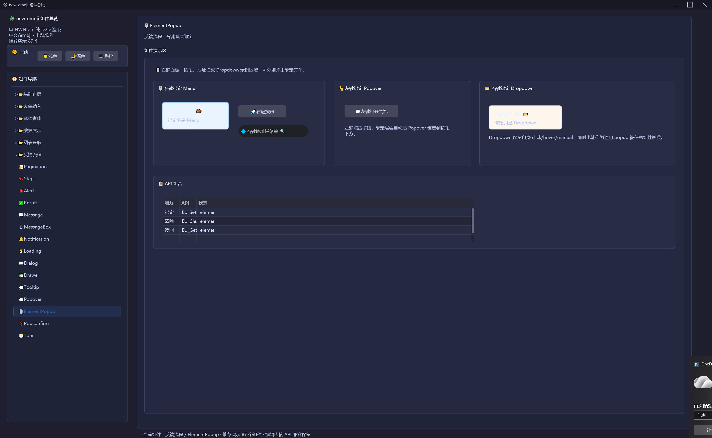

# new_emoji

`new_emoji` 是一个 Windows 原生 UI DLL，已提供易语言、Python ctypes 和 C# P/Invoke 接入说明；同时通过统一的 `EU_` C API、`__stdcall` 调用约定和 UTF-8 字节数组文本参数，也可被 C/C++、Delphi、VB6/VBA、Go、Rust、Node.js FFI、Java JNA/JNI 等能够调用 Windows DLL 的语言接入。它采用单一 HWND + 纯 Direct2D / DirectWrite 渲染，把所有 UI 控件封装成 Element 组件，重点解决传统 GDI 子窗口在缩放和重绘时的闪烁问题，同时原生支持中文与彩色 emoji。

## 特性

- 纯 Direct2D / DirectWrite 渲染，单窗口元素树，减少闪烁。
- 统一 `EU_` C API 导出，适合 DLL 方式集成。
- 文本参数统一使用 UTF-8 字节数组 + 长度，方便易语言传递 emoji 和 Unicode 文本。
- 支持 Win32 与 x64 Release 构建，其中 Win32 是易语言交付优先目标。
- 组件完成度：88 / 88，计划内组件均已完成独立中文 emoji 验证。
- 内置主题、DPI、键鼠交互、Set/Get 状态读回和 Python ctypes helper。

## 快速入口

- [下载组件总览独立运行版 EXE](https://github.com/mosheng20205/new-emoji/releases)
- [文档总览](docs/README.md)
- [快速开始](docs/quick-start.md)
- [构建说明](docs/build.md)
- [API 约定](docs/api-conventions.md)
- [组件文档导航](docs/components/README.md)
- [Python 示例说明](docs/examples/python.md)
- [易语言 DLL 命令](DLL命令/易语言DLL命令.md)
- [C# DLL 命令](DLL命令/CSharp%20DLL命令.md)
- [Python DLL 命令](DLL命令/Python%20DLL命令.md)
- [贡献指南](CONTRIBUTING.md)
- [更新日志](CHANGELOG.md)
- [图片预览](#图片预览)
- [许可证](LICENSE)

## 组件总览 Demo

如果只想快速体验组件效果，可以前往 [Releases 页面](https://github.com/mosheng20205/new-emoji/releases) 下载 `new_emoji_component_gallery.exe`，双击即可运行，不需要安装 Python 环境。

运行完整组件总览：

```powershell
python examples/python/component_gallery.py
```

该 Demo 展示当前 87 个推荐组件；`EditBox` 作为兼容编辑内核保留 API 和文档，不再放入基础布局总览。Demo 包含中文界面、emoji 渲染、主题切换、分类分页、常见交互和复杂组件预览。默认窗口保持 180 秒，便于检查首屏尺寸、DPI 和交互效果。

如果只想短时间冒烟验证：

```powershell
$env:NEW_EMOJI_GALLERY_SECONDS="12"
python examples/python/component_gallery.py
```

公共 Python ctypes 封装位于 `examples/python/new_emoji_ui.py`，普通示例建议优先复用它，而不是从测试目录导入 helper。

## 最短 Python 示例

```python
import ctypes
from ctypes import wintypes
import sys

sys.path.insert(0, "examples/python")
import new_emoji_ui as ui

hwnd = ui.create_window("✨ new_emoji 示例", 240, 120, 820, 560)
root = ui.create_container(hwnd, 0, 0, 0, 780, 500)
ui.create_text(hwnd, root, "你好，new_emoji 🚀", 32, 32, 360, 40)
ui.create_button(hwnd, root, "✅", "确认操作", 32, 96, 160, 42)
ui.dll.EU_ShowWindow(hwnd, 1)

user32 = ctypes.windll.user32
msg = wintypes.MSG()
while user32.GetMessageW(ctypes.byref(msg), None, 0, 0):
    user32.TranslateMessage(ctypes.byref(msg))
    user32.DispatchMessageW(ctypes.byref(msg))
```

> Python 位数必须和 DLL 位数一致：32 位 Python 加载 Win32 DLL，64 位 Python 加载 x64 DLL。

## 最短 C# 示例

```csharp
using System;
using System.Runtime.InteropServices;
using System.Text;

class Program
{
    [DllImport("new_emoji.dll", CallingConvention = CallingConvention.StdCall)]
    static extern IntPtr EU_CreateWindow(byte[] title, int titleLen, int x, int y, int w, int h, uint titlebarColor);

    [DllImport("new_emoji.dll", CallingConvention = CallingConvention.StdCall)]
    static extern int EU_CreateContainer(IntPtr hwnd, int parentId, int x, int y, int w, int h);

    [DllImport("new_emoji.dll", CallingConvention = CallingConvention.StdCall)]
    static extern int EU_CreateText(IntPtr hwnd, int parentId, byte[] text, int textLen, int x, int y, int w, int h);

    [DllImport("new_emoji.dll", CallingConvention = CallingConvention.StdCall)]
    static extern int EU_CreateButton(IntPtr hwnd, int parentId, byte[] emoji, int emojiLen, byte[] text, int textLen, int x, int y, int w, int h);

    [DllImport("new_emoji.dll", CallingConvention = CallingConvention.StdCall)]
    static extern void EU_ShowWindow(IntPtr hwnd, int visible);

    [DllImport("user32.dll")] static extern int GetMessageW(out MSG msg, IntPtr hwnd, uint min, uint max);
    [DllImport("user32.dll")] static extern bool TranslateMessage(ref MSG msg);
    [DllImport("user32.dll")] static extern IntPtr DispatchMessageW(ref MSG msg);

    [StructLayout(LayoutKind.Sequential)]
    struct MSG { public IntPtr hwnd; public uint message; public UIntPtr wParam; public IntPtr lParam; public uint time; public int ptX; public int ptY; }

    static byte[] U8(string text) => Encoding.UTF8.GetBytes(text);

    static void Main()
    {
        byte[] title = U8("✨ new_emoji 示例");
        IntPtr hwnd = EU_CreateWindow(title, title.Length, 240, 120, 820, 560, 0xFF2D7DFF);
        int root = EU_CreateContainer(hwnd, 0, 0, 0, 780, 500);

        byte[] hello = U8("你好，new_emoji 🚀");
        EU_CreateText(hwnd, root, hello, hello.Length, 32, 32, 360, 40);

        byte[] emoji = U8("✅");
        byte[] button = U8("确认操作");
        EU_CreateButton(hwnd, root, emoji, emoji.Length, button, button.Length, 32, 96, 160, 42);

        EU_ShowWindow(hwnd, 1);
        while (GetMessageW(out MSG msg, IntPtr.Zero, 0, 0) > 0)
        {
            TranslateMessage(ref msg);
            DispatchMessageW(ref msg);
        }
    }
}
```

> C# 进程位数必须和 DLL 位数一致：x86 应用加载 Win32 DLL，x64 应用加载 x64 DLL。完整声明见 [C# DLL 命令](DLL命令/CSharp%20DLL命令.md)。

## 最短易语言示例 / DLL 命令入口说明

易语言 IDE 可能无法可靠保存 emoji 和 Unicode 特殊符号，所以示例不在源码字符串里直接写 emoji；窗口标题、正文和按钮文字都用 UTF-8 字节集 + 长度传给 DLL。完整命令表见 [易语言 DLL 命令](DLL命令/易语言DLL命令.md)。

```text
.DLL命令 创建窗口, 整数型, "new_emoji.dll", "EU_CreateWindow"
    .参数 标题字节集指针, 整数型
    .参数 标题长度, 整数型
    .参数 X坐标, 整数型
    .参数 Y坐标, 整数型
    .参数 宽度, 整数型
    .参数 高度, 整数型
    .参数 标题栏颜色, 整数型

.DLL命令 创建容器, 整数型, "new_emoji.dll", "EU_CreateContainer"
    .参数 窗口句柄, 整数型
    .参数 父元素ID, 整数型
    .参数 X坐标, 整数型
    .参数 Y坐标, 整数型
    .参数 宽度, 整数型
    .参数 高度, 整数型

.DLL命令 创建文本, 整数型, "new_emoji.dll", "EU_CreateText"
    .参数 窗口句柄, 整数型
    .参数 父元素ID, 整数型
    .参数 文本字节集指针, 整数型
    .参数 文本长度, 整数型
    .参数 X坐标, 整数型
    .参数 Y坐标, 整数型
    .参数 宽度, 整数型
    .参数 高度, 整数型

.DLL命令 创建按钮, 整数型, "new_emoji.dll", "EU_CreateButton"
    .参数 窗口句柄, 整数型
    .参数 父元素ID, 整数型
    .参数 Emoji字节集指针, 整数型
    .参数 Emoji长度, 整数型
    .参数 文本字节集指针, 整数型
    .参数 文本长度, 整数型
    .参数 X坐标, 整数型
    .参数 Y坐标, 整数型
    .参数 宽度, 整数型
    .参数 高度, 整数型

.DLL命令 显示窗口, , "new_emoji.dll", "EU_ShowWindow"
    .参数 窗口句柄, 整数型
    .参数 是否显示, 整数型
```

```text
'. 把下面代码放到易语言窗口程序的启动事件中；窗口程序自身会提供消息循环。
.局部变量 窗口句柄, 整数型
.局部变量 根容器, 整数型
.局部变量 标题, 字节集
.局部变量 正文, 字节集
.局部变量 按钮Emoji, 字节集
.局部变量 按钮文字, 字节集

'. 标题 UTF-8 字节集：sparkle emoji + " new_emoji " + 中文 示例
标题 ＝ { 226, 156, 168, 32, 110, 101, 119, 95, 101, 109, 111, 106, 105, 32, 231, 164, 186, 228, 190, 139 }
'. 正文 UTF-8 字节集：中文 你好， + "new_emoji " + rocket emoji
正文 ＝ { 228, 189, 160, 229, 165, 189, 239, 188, 140, 110, 101, 119, 95, 101, 109, 111, 106, 105, 32, 240, 159, 154, 128 }
'. 按钮 emoji UTF-8 字节集：check mark emoji
按钮Emoji ＝ { 226, 156, 133 }
'. 按钮文字 UTF-8 字节集：中文 确认操作
按钮文字 ＝ { 231, 161, 174, 232, 174, 164, 230, 147, 141, 228, 189, 156 }

窗口句柄 ＝ 创建窗口 (取变量数据地址 (标题), 取字节集长度 (标题), 240, 120, 820, 560, -13795841)
根容器 ＝ 创建容器 (窗口句柄, 0, 0, 0, 780, 500)
创建文本 (窗口句柄, 根容器, 取变量数据地址 (正文), 取字节集长度 (正文), 32, 32, 360, 40)
创建按钮 (窗口句柄, 根容器, 取变量数据地址 (按钮Emoji), 取字节集长度 (按钮Emoji), 取变量数据地址 (按钮文字), 取字节集长度 (按钮文字), 32, 96, 160, 42)
显示窗口 (窗口句柄, 1)
```

## 构建

```powershell
& "C:\Program Files\Microsoft Visual Studio\2022\Community\MSBuild\Current\Bin\MSBuild.exe" .\new_emoji.sln /p:Configuration=Release /p:Platform=Win32
& "C:\Program Files\Microsoft Visual Studio\2022\Community\MSBuild\Current\Bin\MSBuild.exe" .\new_emoji.sln /p:Configuration=Release /p:Platform=x64
```

详细要求见 [构建说明](docs/build.md)。

## 文档维护

当某个组件新增、删除、重命名或修改导出 API 时，必须同步更新该组件文档、组件导航、`docs/api-index.md`、Python ctypes/helper，以及 `DLL命令/易语言DLL命令.md`、`DLL命令/CSharp DLL命令.md`、`DLL命令/Python DLL命令.md`，避免开源用户看到过期接口。

## 图片预览

截图较多，默认折叠；点击下方标题可展开查看组件总览截图。

<details>
<summary>展开 90 张组件截图</summary>

<p>





</p>

</details>

## 许可证

本项目使用 [MIT License](LICENSE) 开源。
